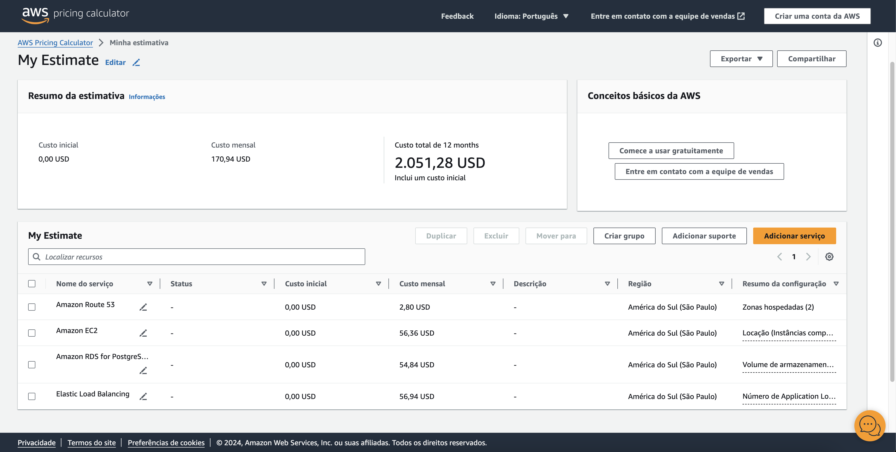

# RELATÓRIO DE IMPLEMENTAÇÃO DE SERVIÇOS AWS
Data: 22 DE ABRIL DE 2024
Empresa: ABSTERGO INDUSTRIES
Responsável: ROBERTA DE SIQUEIRA

## Introdução
Este relatório apresenta o processo de implementação de ferramentas na empresa ABSTERGO INDUSTRIES, realizado por ROBERTA DE SIQUEIRA. O objetivo do projeto foi elencar 3 serviços AWS, com a finalidade de realizar diminuição de custos imediatos, trocando os custos de CAPEX para OPEX.

## Descrição do Projeto
O projeto de implementação de ferramentas foi dividivo em 3 etapas, cada uma com seus objetivos específicos. A seguir, serão descritas as etapas do projeto?

Etapa 1:
- AWS EC2
> A aplicação será implantada no serviço EC2, serviço da AWS que disponibiliza capacidade computacinal para criar máquinas virtuais para executar a aplicação de modo rápido e fácil.
> Será usada para implantar e executar as aplicações.

- ALTA DISPONIBILIDADE
> O serviço de Load Balance e Auto Scaling da AWS deixam a aplicação com distribuição e tráfego disponível e automatizado.
> Estes serviços serão usados para automatizar a escalabidade e distribuição da API, sempre configurado para ter alta disponibilidade com a escalabilidade de 2 zonas de disponibilidades e distribuindo o tráfego para uma melhor experiência do usuário.
 
- AWS RDS
> Serviço de banco de dados relacional gerenciado pela AWS, simples, fácil configuração, escalável e seguro.
> O banco de dados será migrado para este serviço com o intuito de buscar a facilidade de configuração, gerenciamento, alta disponibilidade e recuperação automática, escalabilidade e segurança.

## Conclusão
A implementação de ferramentas na empresa ABSTERGO INDUSTRIES tem como esperado buscar acessibilidade, resiliência e disponibilidade, o que aumentará a eficiência e a produtividade da empresa. Recomenta-se a continuidade da utilização das ferramentas implementadas e a busca por novas tecnologias que possam melhorar ainda mais os processos da empresa.

## Anexos
- Diagrama da Arquitetura proposta:

- Orçamento estimado para proposta apresentada:

*Detalhes da simulação estão no link:* https://calculator.aws/#/estimate?id=fbe1845c8f2dbbc0df64e670e30a33d12cfbd348

--------------------

> Assinatura do Responsável pelo Projeto: 

**_ROBERTA DE SIQUEIRA_**